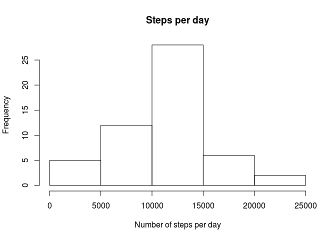
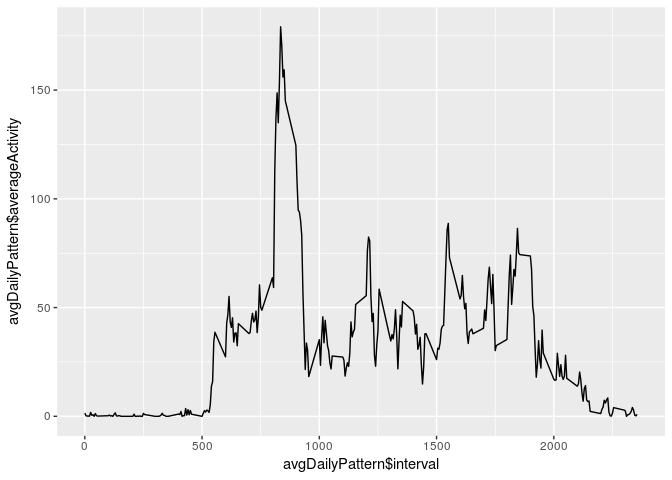
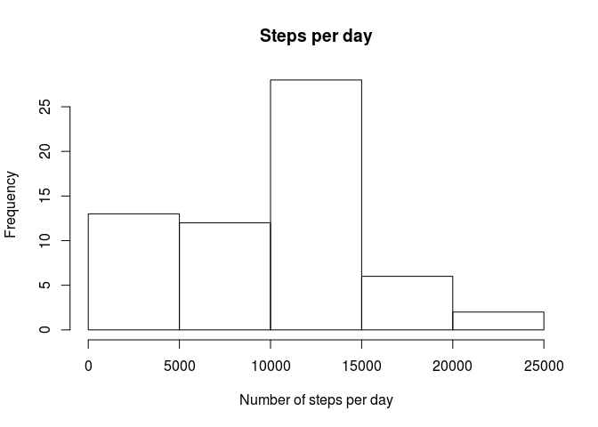
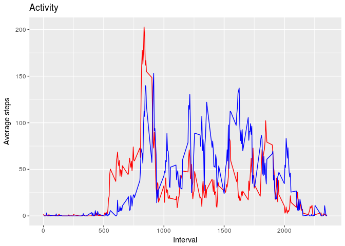

# Reproducible Research: Peer Assessment 1

## Set the number formatter (the number of decimal places)

```r
options(scipen=1, digits=2)
```

## Set locale to English
Because English is not the default language of my operating system and one of the functions used in the assignment uses the locale to return the names of days of the week (the weekdays function) it is necessary to change the locale to English.

```r
Sys.setlocale("LC_ALL", 'en_GB.UTF-8')
```

```
## [1] "LC_CTYPE=en_GB.UTF-8;LC_NUMERIC=C;LC_TIME=en_GB.UTF-8;LC_COLLATE=en_GB.UTF-8;LC_MONETARY=en_GB.UTF-8;LC_MESSAGES=en_US.UTF-8;LC_PAPER=pl_PL.UTF-8;LC_NAME=C;LC_ADDRESS=C;LC_TELEPHONE=C;LC_MEASUREMENT=pl_PL.UTF-8;LC_IDENTIFICATION=C"
```

```r
Sys.setenv(LANG = "en_US.UTF-8")
```

Load ggplot library

```r
library(ggplot2)
```

## Loading and preprocessing the data

```r
zipFileName <- "activity.zip"
data <- read.csv(unzip(zipFileName))
```

## Total number of steps taken per day

```r
stepsPerDay <- aggregate(data$steps, by=list(data$date), FUN=sum)
colnames(stepsPerDay) <- c("date", "stepsPerDay")
stepsPerDay
```

```
##          date stepsPerDay
## 1  2012-10-01          NA
## 2  2012-10-02         126
## 3  2012-10-03       11352
## 4  2012-10-04       12116
## 5  2012-10-05       13294
## 6  2012-10-06       15420
## 7  2012-10-07       11015
## 8  2012-10-08          NA
## 9  2012-10-09       12811
## 10 2012-10-10        9900
## 11 2012-10-11       10304
## 12 2012-10-12       17382
## 13 2012-10-13       12426
## 14 2012-10-14       15098
## 15 2012-10-15       10139
## 16 2012-10-16       15084
## 17 2012-10-17       13452
## 18 2012-10-18       10056
## 19 2012-10-19       11829
## 20 2012-10-20       10395
## 21 2012-10-21        8821
## 22 2012-10-22       13460
## 23 2012-10-23        8918
## 24 2012-10-24        8355
## 25 2012-10-25        2492
## 26 2012-10-26        6778
## 27 2012-10-27       10119
## 28 2012-10-28       11458
## 29 2012-10-29        5018
## 30 2012-10-30        9819
## 31 2012-10-31       15414
## 32 2012-11-01          NA
## 33 2012-11-02       10600
## 34 2012-11-03       10571
## 35 2012-11-04          NA
## 36 2012-11-05       10439
## 37 2012-11-06        8334
## 38 2012-11-07       12883
## 39 2012-11-08        3219
## 40 2012-11-09          NA
## 41 2012-11-10          NA
## 42 2012-11-11       12608
## 43 2012-11-12       10765
## 44 2012-11-13        7336
## 45 2012-11-14          NA
## 46 2012-11-15          41
## 47 2012-11-16        5441
## 48 2012-11-17       14339
## 49 2012-11-18       15110
## 50 2012-11-19        8841
## 51 2012-11-20        4472
## 52 2012-11-21       12787
## 53 2012-11-22       20427
## 54 2012-11-23       21194
## 55 2012-11-24       14478
## 56 2012-11-25       11834
## 57 2012-11-26       11162
## 58 2012-11-27       13646
## 59 2012-11-28       10183
## 60 2012-11-29        7047
## 61 2012-11-30          NA
```


```r
hist(stepsPerDay$stepsPerDay, xlab="Number of steps per day", main="Steps per day")
```

<!-- -->

## The mean and median of the total number of steps taken per day
Mean (without NA values): 10766.19
Median (without NA values): 10765


## Imputing missing values

Note that I changed the order of tasks, this is a part of the third task.

I could either remove all NA values or replace them with zeros, because if a person was not using the tracker he or she tracked zero steps.
The following code replaces all NA values with zeros.

```r
dataWithoutNa <- data
dataWithoutNa[is.na(data)] <- 0
```

## What is the average daily activity pattern?

It does not make any sense to calculate the average daily activity using data with NA values, hence I decided to use data with NA values replaced with zeros.


```r
avgDailyPattern <- aggregate(dataWithoutNa$steps, by=list(dataWithoutNa$interval), FUN=mean, na.action=na.omit)
colnames(avgDailyPattern) <- c("interval", "averageActivity")
```

Daily activity pattern

```r
ggplot(avgDailyPattern, aes(avgDailyPattern$interval, avgDailyPattern$averageActivity)) + geom_line()
```

<!-- -->

The most active interval: 835, 179.13

## Task 3

The number of missing values in the dataset can be calculated using the summary function. The function returns the number of NA values as one of the calculated properties.


```r
summary(data)
```

```
##      steps              date          interval   
##  Min.   :  0    2012-10-01:  288   Min.   :   0  
##  1st Qu.:  0    2012-10-02:  288   1st Qu.: 589  
##  Median :  0    2012-10-03:  288   Median :1178  
##  Mean   : 37    2012-10-04:  288   Mean   :1178  
##  3rd Qu.: 12    2012-10-05:  288   3rd Qu.:1766  
##  Max.   :806    2012-10-06:  288   Max.   :2355  
##  NA's   :2304   (Other)   :15840
```

I replaced missing values with zeros in one of the previous steps.

Histogram of the values without NAs

```r
stepsPerDay <- aggregate(dataWithoutNa$steps, by=list(dataWithoutNa$date), FUN=sum)
colnames(stepsPerDay) <- c("date", "stepsPerDay")
hist(stepsPerDay$stepsPerDay, xlab="Number of steps per day", main="Steps per day")
```

<!-- -->

Mean: 9354.23
Median: 10395

The values differ because in the first part of the assignement if I used mean and median functions without the na.rm=TRUE parameter both function would return NAs.
Because the parameter was used the function skipped missing values.
In the third task missing values have been replaced with zeros which significantly modified the mean and median.

The choosen method of replacing missing values with numbers does not alter the total number of steps per day.

## Are there differences in activity patterns between weekdays and weekends?

A function which decides whether the date is on a weekend or is a weekday

```r
dayOfWeek <- weekdays(as.Date(dataWithoutNa$date))
weekdayOrWeekend <- function(x) if(x == "Sunday" | x == "Saturday") "weekend" else "weekday"
typeOfDay <- sapply(dayOfWeek, FUN = weekdayOrWeekend)
dataWithoutNa$typeOfDay <- typeOfDay

head(dataWithoutNa)
```

```
##   steps       date interval typeOfDay
## 1     0 2012-10-01        0   weekday
## 2     0 2012-10-01        5   weekday
## 3     0 2012-10-01       10   weekday
## 4     0 2012-10-01       15   weekday
## 5     0 2012-10-01       20   weekday
## 6     0 2012-10-01       25   weekday
```

The difference between activity on a weekday and during weekends

```r
dataWeekday <- dataWithoutNa[dataWithoutNa$typeOfDay == "weekday",]
avgDailyPatternWeekday <- aggregate(dataWeekday$steps, by=list(dataWeekday$interval), FUN=mean, na.action=na.omit)
colnames(avgDailyPatternWeekday) <- c("interval", "averageActivity")

dataWeekend <- dataWithoutNa[dataWithoutNa$typeOfDay == "weekend",]
avgDailyPatternWeekend <- aggregate(dataWeekend$steps, by=list(dataWeekend$interval), FUN=mean, na.action=na.omit)
colnames(avgDailyPatternWeekend) <- c("interval", "averageActivity")

ggplot() +
  geom_line(data = avgDailyPatternWeekday, aes(interval, averageActivity), color = "red") +
  geom_line(data = avgDailyPatternWeekend, aes(interval, averageActivity), color = "blue") +
  labs(title = "Activity", x = "Interval", y = "Average steps", color = "Day of week") +
  scale_color_manual(labels = c("Weekday", "Weekend"), values = c("red", "blue"))
```

<!-- -->
